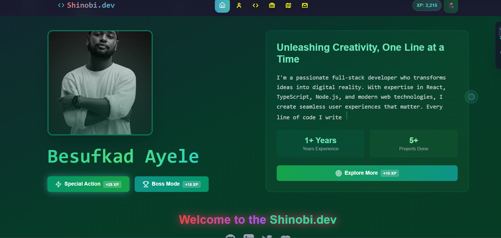

# Besufkad Ayele - Portfolio

> Modern, interactive portfolio showcasing full-stack development and product design expertise with advanced 3D animations and gamified user experience.



## ✨ Features

- 🎨 **Premium Design System** - Professional color palette with gold accents
- 🎯 **Full-Page Sections** - Immersive 100vh sections for focused content
- 🎬 **Advanced 3D Animations** - Perspective transforms, parallax effects, and spring physics
- 🖱️ **Custom Cursor** - Interactive cursor with hover states
- 📱 **Fully Responsive** - Optimized for desktop, tablet, and mobile
- ⌨️ **Keyboard Navigation** - Arrow keys, PageUp/Down, Home/End support
- 📥 **CV Download** - Instant resume download functionality
- 🎮 **Gamified Experience** - Progress tracking and interactive elements
- 🚀 **Performance Optimized** - GPU-accelerated animations, lazy loading

## 🎨 Design Highlights

### Color Palette
- **Black** (#0a0a08) - Sophisticated dark background
- **Gold** (#c9a84c) - Luxurious accent color
- **Off-White** (#f0ede6) - Premium text color
- **Warm Gray** (#8a8278) - Secondary text
- **Green Accents** - Environmental depth

### Typography
- **Bebas Neue** - Display headings
- **DM Serif Display** - Elegant titles
- **DM Mono** - Technical labels
- **Outfit** - Clean body text

## 🚀 Quick Start

### Prerequisites
- Node.js 18+ or Bun
- npm, pnpm, or bun package manager

### Installation

```bash
# Clone the repository
git clone https://github.com/besufkad-ayele/portfolio.git
cd portfolio

# Install dependencies (choose one)
npm install
# or
pnpm install
# or
bun install
```

### Development

```bash
# Start development server
npm run dev
# or
pnpm dev
# or
bun dev
```

Open [http://localhost:5173](http://localhost:5173) in your browser.

### Build for Production

```bash
# Create optimized production build
npm run build
# or
pnpm build
# or
bun run build

# Preview production build
npm run preview
```

## 📁 Project Structure

```
portfolio/
├── public/
│   ├── assets/          # Project images
│   ├── cv/             # Resume file
│   └── portfolio_image.png
├── src/
│   ├── components/     # React components
│   │   ├── HeroSection.tsx
│   │   ├── AboutSection.tsx
│   │   ├── SkillsSection.tsx
│   │   ├── ProjectsSection.tsx
│   │   ├── ExperienceSection.tsx
│   │   ├── ContactSection.tsx
│   │   ├── VerticalNav.tsx
│   │   └── CustomCursor.tsx
│   ├── pages/
│   │   └── Index.tsx   # Main orchestration
│   ├── index.css       # Global styles
│   └── main.tsx        # Entry point
├── PORTFOLIO_FEATURES.md  # Detailed features documentation
└── README.md
```

## 🎯 Navigation

### Multiple Navigation Methods
1. **Scroll** - Use mouse wheel to navigate between sections
2. **Keyboard** - Arrow keys, PageUp/Down, Home/End
3. **Left Navigation** - Click section labels in floating nav
4. **Section Dots** - Click indicators on the right side

### Sections
- 🏠 **Hero** - Introduction with 3D profile image
- 👤 **About** - Background and expertise
- 💪 **Skills** - Technical and design skills grid
- 🚀 **Projects** - Featured work with images
- 💼 **Experience** - Career timeline
- 📧 **Contact** - Get in touch

## 🎬 Animation Features

### 3D Effects
- Mouse-tracking parallax on hero image
- Perspective transforms on section transitions
- Spring physics for natural motion
- Depth-based layering

### Scroll Animations
- Smooth full-page section transitions
- Staggered element reveals
- Progress tracking visualization
- Fade + translate + rotate combinations

### Micro-Interactions
- Hover lift effects on cards
- Scale animations on buttons
- Color transitions on interactions
- Custom cursor responsiveness

## 🛠️ Tech Stack

- **Framework**: React 18.3 with TypeScript
- **Build Tool**: Vite 5
- **Styling**: Tailwind CSS + Custom CSS
- **Animations**: Framer Motion 12
- **Icons**: Lucide React
- **Routing**: React Router v6
- **Fonts**: Google Fonts (Bebas Neue, DM Serif, DM Mono, Outfit)

## 📝 Customization

### Update Personal Information
Edit the content in each component file:
- `src/components/HeroSection.tsx` - Name, title, stats
- `src/components/AboutSection.tsx` - Bio, highlights
- `src/components/SkillsSection.tsx` - Technical skills
- `src/components/ProjectsSection.tsx` - Portfolio projects
- `src/components/ExperienceSection.tsx` - Work history
- `src/components/ContactSection.tsx` - Contact details

### Update Images
Replace images in the `public/` directory:
- `portfolio_image.png` - Hero profile photo
- `assets/` - Project screenshots
- `cv/` - Resume file

### Modify Colors
Update CSS variables in `src/index.css`:
```css
:root {
  --black: #0a0a08;
  --gold: #c9a84c;
  --off-white: #f0ede6;
  /* ... other colors */
}
```

## 📦 Deployment

### Vercel (Recommended)
```bash
# Install Vercel CLI
npm i -g vercel

# Deploy
vercel
```

### Netlify
```bash
# Build command
npm run build

# Publish directory
dist
```

### GitHub Pages
```bash
# Install gh-pages
npm install -D gh-pages

# Add to package.json scripts
"deploy": "gh-pages -d dist"

# Deploy
npm run build && npm run deploy
```

## 📄 Documentation

See [PORTFOLIO_FEATURES.md](PORTFOLIO_FEATURES.md) for detailed documentation of all features, animations, and design decisions.

## 📄 License

This project is open source and available under the [MIT License](LICENSE).

## 👤 Contact

**Besufkad Ayele**
- Email: ayebesufkad@gmail.com
- GitHub: [@besufkad-ayele](https://github.com/besufkad-ayele)
- LinkedIn: [besufkad-ayele](https://www.linkedin.com/in/besufkad-ayele)
- Phone: +251 976 502 575

---

Built with ❤️ using React, TypeScript, and Framer Motion
